# -NYTimes-Fox-News-Climate-Change-Topic-Modelling-BERTopic

## Dataset & Preparation
The Dataset includes articles from the Nytimes & Fox News over a one year period, and studies and contrasts them based on the use of Climate Change Articles. It details the process of identifying and counting articles related to climate change from NYTimes and Fox News, using specific climate-related terms and a function to determine if an article is related to climate change. This includes filtering duplicates, selecting English language articles, merging title and body columns, and creating a new column for the source URI.

## Proportion Calculation
It calculates the proportion of climate change articles to total articles by source, resulting in percentages for both NYTimes and Fox News.

- Climate Article Analysis: It filters and counts climate change-related articles, comparing the proportion of such articles to the total number of articles over time.
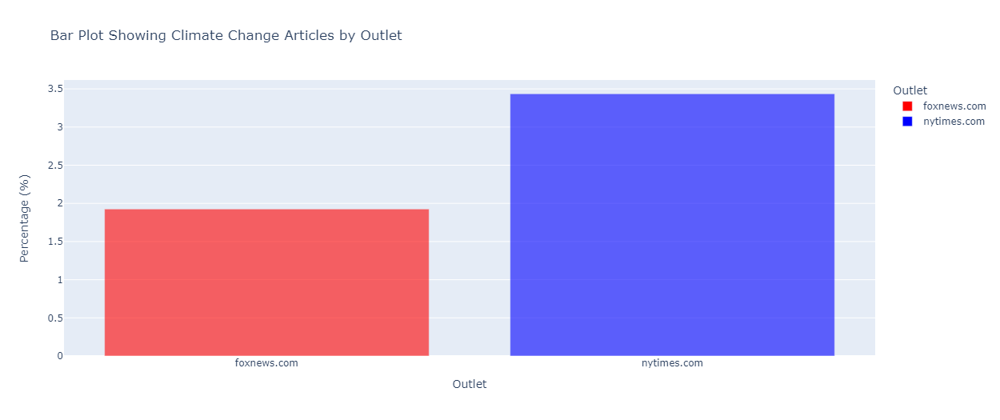

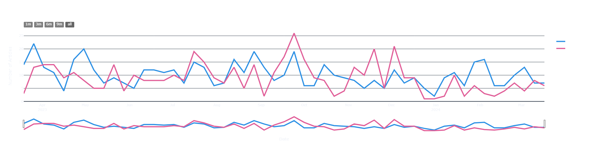
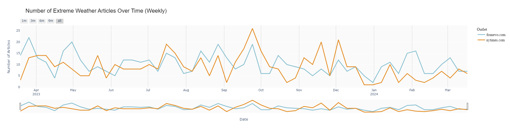

- Visualization: The notebook contains code to create interactive bar charts and line plots using Plotly to visualize the distribution of climate change articles by news outlet and over time.
- Topic Modeling: It demonstrates the use of BERTopic for topic modeling, including the initialization of the SentenceTransformer model, creation of vectorized text, and visualization of topics over time.

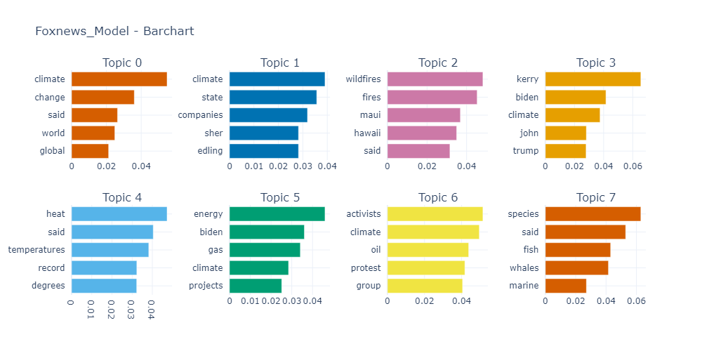
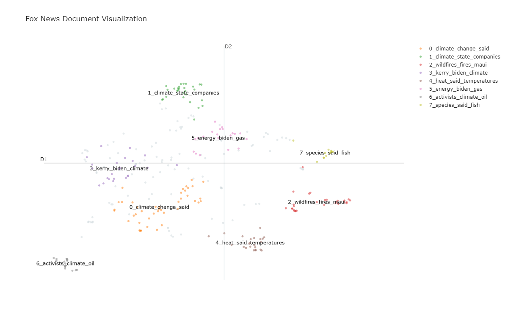
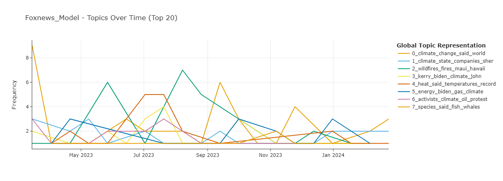
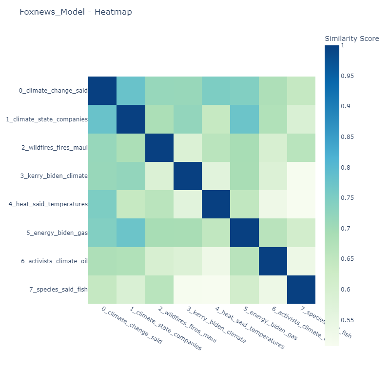
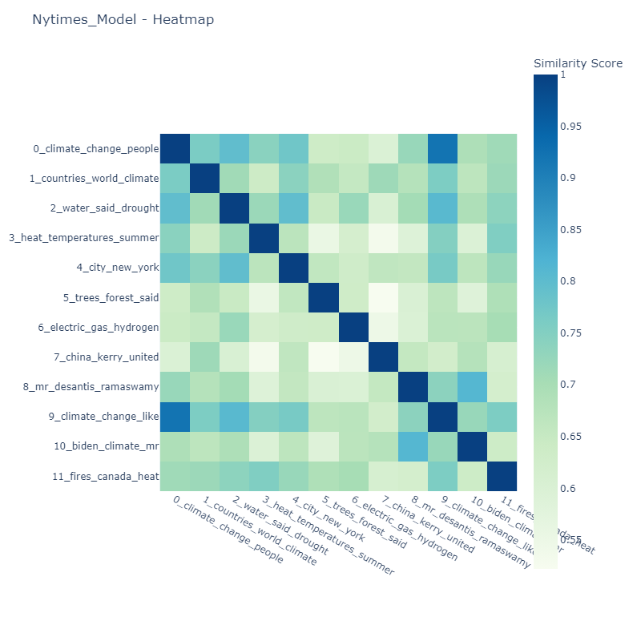
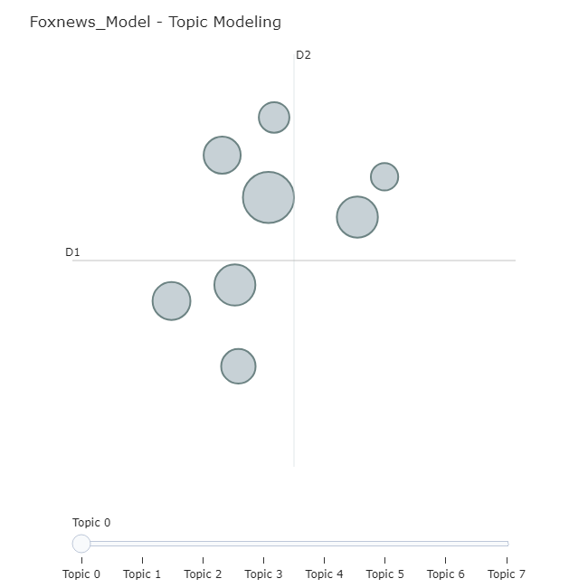
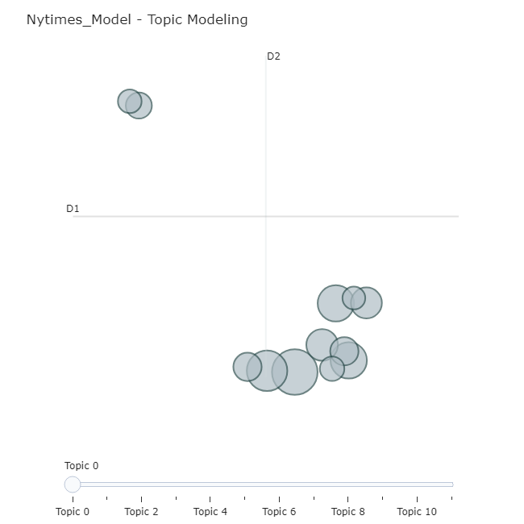
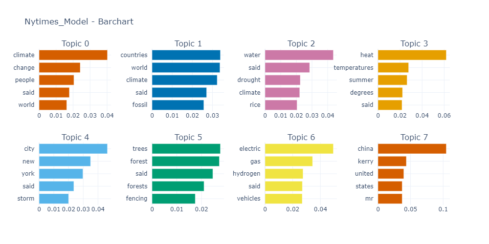
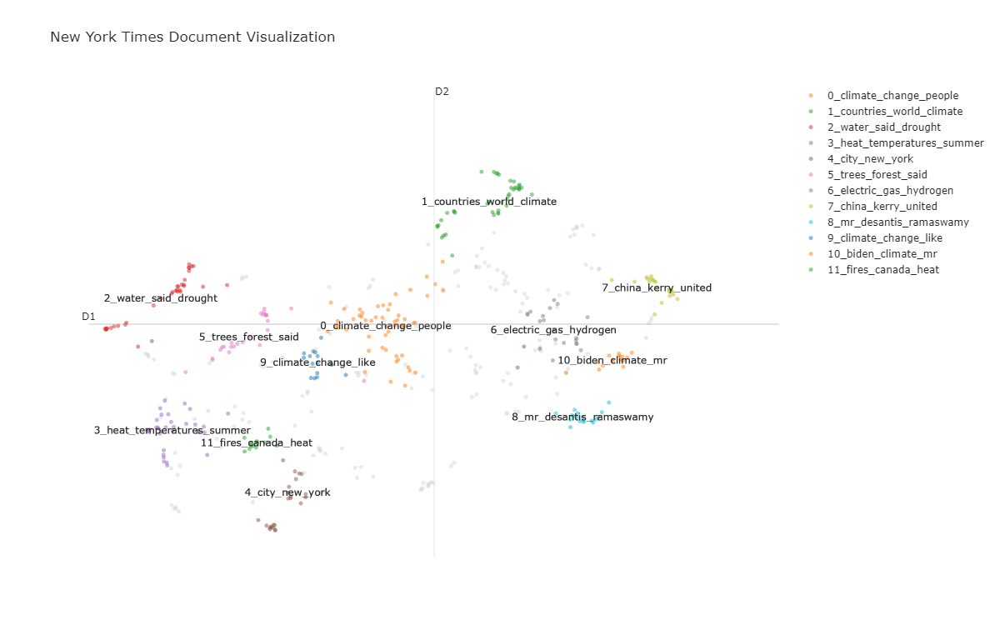
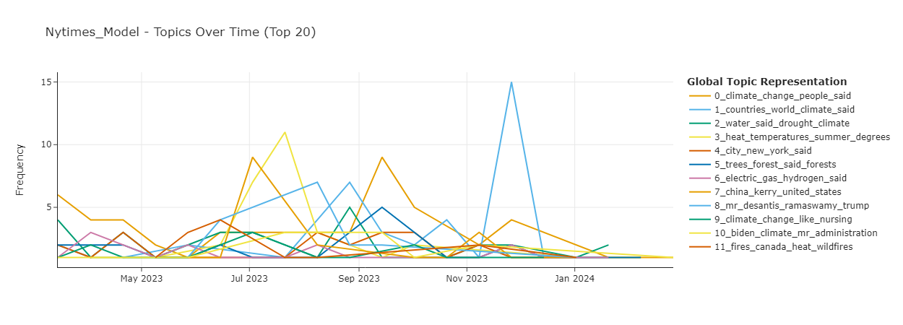
